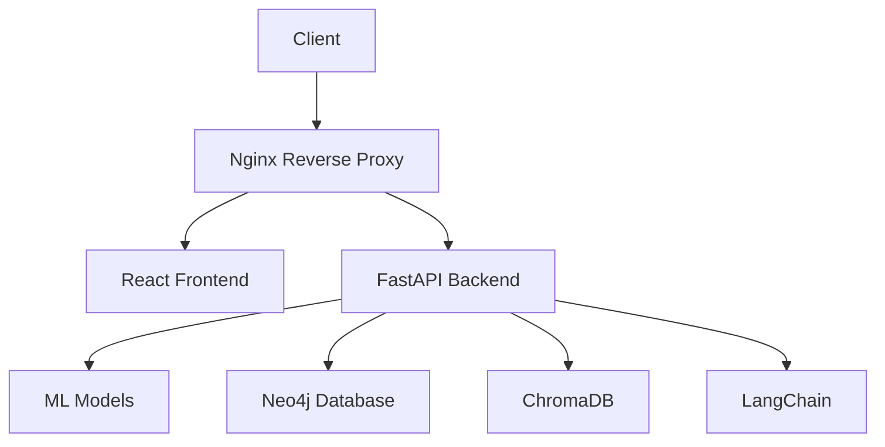

# 🤖 Insurance Bot - AI-Powered Insurance Recommendation System


*Add a banner image showcasing your project's interface*

## 📝 Table of Contents
- [Demo](#demo)
- [Features](#features)
- [Technology Stack](#technology-stack)
- [Architecture](#architecture)
- [Setup and Installation](#setup-and-installation)
- [Usage Guide](#usage-guide)
- [API Documentation](#api-documentation)
- [Team](#team)

## 🎥 Demo <a name="demo"></a>

[](your_youtube_link_here)

*Add your project demo video link here*

### 📸 Screenshots

<table>
  <tr>
    <td></td>
    <td></td>
  </tr>
  <tr>
    <td></td>
    <td></td>
  </tr>
</table>

## ✨ Features <a name="features"></a>

### 🌍 Multi-Country Support
- **India & Australia Coverage**
- Region-specific policy recommendations
- Currency and regulation compliance

### 🎯 Insurance Types
- 🏥 Health Insurance
- 💖 Life Insurance
- ✈️ Travel Insurance
- 🏠 House Insurance
- 🚗 Vehicle Insurance

### 🤖 AI-Powered Features
- **Smart Recommendations**: ML models trained on extensive insurance data
- **Natural Language Processing**: Advanced chat interface using LangChain
- **Real-time Premium Calculation**: Instant cost estimates
- **Policy Explanation**: AI-generated simple explanations of complex terms

### 📊 Data Visualization
- Interactive dashboards
- Premium comparison charts
- Coverage analysis graphs

## 🛠 Technology Stack <a name="technology-stack"></a>

### Backend Technologies
- **Python 3.9**
- **FastAPI**: High-performance web framework
- **LangChain**: For AI/ML operations
- **Neo4j**: Graph database for complex insurance relationships
- **ChromaDB**: Vector database for semantic search
- **scikit-learn & PyTorch**: For ML models
- **Pandas & NumPy**: Data processing
- **Docker**: Containerization

### Frontend Technologies
- **React.js**: UI framework
- **Material-UI**: Component library
- **Chart.js**: Data visualization
- **Axios**: API integration

### DevOps & Tools
- **Docker & Docker Compose**: Containerization
- **GitHub Actions**: CI/CD
- **Nginx**: Web server
- **Gunicorn**: WSGI server

## 🏗 Architecture <a name="architecture"></a>



## 🚀 Setup and Installation <a name="setup-and-installation"></a>

### Prerequisites
- Docker and Docker Compose
- Git

### Quick Start
1. Clone the repository:
   ```bash
   git clone https://github.com/Ishaan2605/Insurance-Bot.git
   cd Insurance-Bot
   ```

2. Start with Docker Compose:
   ```bash
   docker-compose up --build
   ```

3. Access the application:
   - Frontend: http://localhost:80
   - Backend API: http://localhost:8000
   - API Docs: http://localhost:8000/docs

### Manual Setup (Development)

#### Backend Setup
```bash
# Create virtual environment
python -m venv venv
source venv/bin/activate  # Linux/Mac
# OR
.\\venv\\Scripts\\activate  # Windows

# Install dependencies
pip install -r requirements.txt

# Start the server
uvicorn app:app --reload --port 8000
```

#### Frontend Setup
```bash
cd mufg-insurance-frontend
npm install
npm start
```

## � Usage Guide <a name="usage-guide"></a>

1. **Select Country**: Choose between India and Australia
2. **Choose Insurance Type**: Select from Health, Life, Travel, House, or Vehicle insurance
3. **Fill Details**: Provide required information
4. **Get Recommendations**: Receive AI-powered insurance suggestions
5. **Chat for Details**: Use the chat interface for specific queries

## 📚 API Documentation <a name="api-documentation"></a>

Detailed API documentation is available at `/docs` endpoint. Key endpoints include:

- `POST /recommend`: Get insurance recommendations
- `POST /chat`: Interact with AI assistant
- `GET /policies`: List available policies
- `POST /calculate-premium`: Get premium estimates

## 👥 Team <a name="team"></a>

<table>
  <tr>
    <td align="center">
      
      <br />
      <b>Team Member 1</b>
      <br />
      Role
    </td>
    <!-- Add more team members similarly -->
  </tr>
</table>

## � License

This project is licensed under the MIT License - see the [LICENSE](LICENSE) file for details.

---

<p align="center">
  Made with ❤️ by Team Insurance Bot
</p>


### 2. Setup the Backend

Navigate to the backend directory, install dependencies, and set up your environment variables.

cd backend
npm install


Create a `.env` file in the `backend` directory and add your Groq API key:

GROQ_API_KEY="YOUR_GROQ_API_KEY_HERE"


### 3. Setup the Frontend

In a new terminal, navigate to the frontend directory and install its dependencies.

cd frontend
npm install


### 4. Run the Application

You need to run both the backend and frontend servers simultaneously.

-   **Run the Backend Server:**
    ```
    # In the /backend directory
    npm start
    ```

-   **Run the Frontend Development Server:**
    ```
    # In the /frontend directory
    npm start
    ```

The application should now be running on `http://localhost:3000`.

## 🤖 Usage

Interact with the chatbot using natural language. Here are some example queries and the expected types of responses:

**1. Ask for policy details:**
> **You:** "What are the details of my auto insurance policy?"
> **Bot:** "Your auto insurance policy (ID: `POL45678`) covers comprehensive and collision damage with a deductible of $500. Your next premium payment of $120 is due on September 1, 2025."

**2. Check a claim's status:**
> **You:** "What is the status of my claim #CLM12345?"
> **Bot:** "Your claim #CLM12345 for water damage is currently under review. An adjuster has been assigned, and you can expect an update within 3-5 business days."

**3. Update a real-time dashboard:**
> **You:** "Show me the distribution of claims by category for this month."
> **Bot:** "Certainly. I have updated the dashboard to show the claim distribution for the current month."
> *(The dashboard embedded in the UI will update instantly)*

## 💻 Tech Stack

-   **Frontend:** React, Socket.IO Client, Axios
-   **Backend:** Node.js, Express.js, Socket.IO
-   **LLM Integration:** Groq API (Llama 3)
-   **Real-Time Data:** WebSockets
-   **Dashboard:** Microsoft Power BI or a custom React-based dashboard
-   **Deployment:** Vercel (Frontend), Render (Backend)

## 🏆 Hackathon Use Cases

This project demonstrates several practical applications for the insurance industry:

1.  **24/7 Customer Support:** Provide instant, automated support to customers, reducing call center volume and improving user satisfaction.
2.  **Instant First Notice of Loss (FNOL):** Allow users to initiate a claim directly through the chatbot, speeding up the claims process.
3.  **Fraud Detection Aid:** Analyze user queries and data points in real-time to flag potentially fraudulent claims for review.
4.  **Personalized Policy Recommendations:** Analyze user data to suggest relevant insurance products or coverage upgrades.

## 🤝 Contributing

Contributions are welcome! If you'd like to improve Insurance Bot, please follow these steps:

1.  **Fork** the repository.
2.  Create a new **branch** (`git checkout -b feature/AmazingFeature`).
3.  Make your changes and **commit** them (`git commit -m 'Add some AmazingFeature'`).
4.  **Push** to the branch (`git push origin feature/AmazingFeature`).
5.  Open a **Pull Request**.

## 📄 License

This project is licensed under the MIT License.

