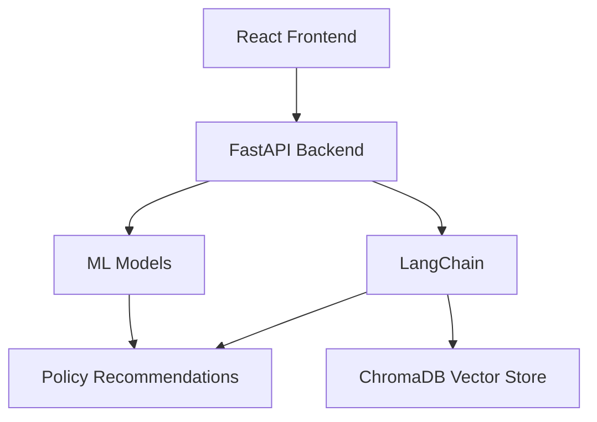

# 🤖 Insurance Bot - AI-Powered Insurance Recommendation System

## 📝 Overview
Insurance Bot is an intelligent recommendation system that helps users find the most suitable insurance policies based on their profile and requirements. The system supports multiple insurance types across different countries, leveraging machine learning and natural language processing to provide personalized recommendations with clear explanations.


## ✨ Features <a name="features"></a>

### 🌍 Multi-Country Support
- **India & Australia Coverage**
- Region-specific policy recommendations
- Currency and regulation compliance

### 🎯 Insurance Types
- 🏥 Health Insurance
- 💖 Life Insurance
- ✈️ Travel Insurance
- 🏠 House Insurance
- 🚗 Vehicle Insurance

### 🤖 AI-Powered Features
- **Smart Recommendations**: ML models trained on extensive insurance data
- **Natural Language Processing**: Advanced chat interface using LangChain
- **Real-time Premium Calculation**: Instant cost estimates
- **Policy Explanation**: AI-generated simple explanations of complex terms

### 📊 Data Visualization
- Interactive dashboards
- Premium comparison charts
- Coverage analysis graphs

## 🛠 Technology Stack <a name="technology-stack"></a>

### Backend (FastAPI)
- **Python + FastAPI**: High-performance API backend
- **scikit-learn**: ML model training and inference
- **LangChain**: Natural language processing and explanations
- **ChromaDB**: Vector storage for RAG capabilities
- **Pydantic**: Data validation and settings management

### Frontend (React)
- **React**: Modern UI framework
- **Material-UI**: Component library
- **React Router**: Navigation and routing
- **Axios**: API integration

## 🏗 Architecture <a name="architecture"></a>



## 🚀 Setup and Installation <a name="setup-and-installation"></a>

### Prerequisites
- Docker and Docker Compose
- Git

### Quick Start
1. Clone the repository:
   ```bash
   git clone https://github.com/Ishaan2605/Insurance-Bot.git
   cd Insurance-Bot
   ```

2. Start with Docker Compose:
   ```bash
   docker-compose up --build
   ```

3. Access the application:
   - Frontend: http://localhost:80
   - Backend API: http://localhost:8000
   - API Docs: http://localhost:8000/docs

### Manual Setup (Development)

#### Backend Setup
```bash
# Create virtual environment
python -m venv venv
source venv/bin/activate  # Linux/Mac
# OR
.\\venv\\Scripts\\activate  # Windows

# Install dependencies
pip install -r requirements.txt

# Start the server
uvicorn app:app --reload --port 8000
```

#### Frontend Setup
```bash
cd mufg-insurance-frontend
npm install
npm start
```

## � Usage Guide <a name="usage-guide"></a>

1. **Select Country**: Choose between India and Australia
2. **Choose Insurance Type**: Select from Health, Life, Travel, House, or Vehicle insurance
3. **Fill Details**: Provide required information
4. **Get Recommendations**: Receive AI-powered insurance suggestions
5. **Chat for Details**: Use the chat interface for specific queries

## 📚 API Documentation

The API provides the following main endpoint:

### POST /recommend
Get insurance policy recommendations with explanations

**Request Body:**
```json
{
    "country": "india|australia",
    "policy": "health|life|travel|house|vehicle",
    "data": {
        // User profile and requirements data
    }
}
```

**Response:**
```json
{
    "country": "string",
    "policy": "string",
    "recommendation": {
        // Policy recommendations
    },
    "explanations": {
        // Natural language explanations
    }
}
```

Full API documentation is available at `/docs` when running the server.

## 🔧 Project Structure

```
├── app.py                 # FastAPI application
├── requirements.txt       # Python dependencies
├── artifacts/            # ML model artifacts
│   ├── india_*/         # India models
│   └── australia_*/     # Australia models
├── scripts/
│   ├── api/             # API utilities
│   ├── llm/             # LLM integration
│   ├── preprocessing/   # Data preprocessing
│   ├── rag/            # RAG implementation
│   └── recommendation/  # ML prediction logic
├── mufg-insurance-frontend/
│   ├── src/            # React source code
│   └── public/         # Static assets
└── vectorstore/        # ChromaDB storage
```

## � License

This project is licensed under the MIT License - see the [LICENSE](LICENSE) file for details.

---

<p align="center">
  Made with ❤️ by Team Insurance Bot
</p>


### 2. Setup the Backend

Navigate to the backend directory, install dependencies, and set up your environment variables.

cd backend
npm install


Create a `.env` file in the `backend` directory and add your Groq API key:

GROQ_API_KEY="YOUR_GROQ_API_KEY_HERE"


### 3. Setup the Frontend

In a new terminal, navigate to the frontend directory and install its dependencies.

cd frontend
npm install


### 4. Run the Application

You need to run both the backend and frontend servers simultaneously.

-   **Run the Backend Server:**
    ```
    # In the /backend directory
    npm start
    ```

-   **Run the Frontend Development Server:**
    ```
    # In the /frontend directory
    npm start
    ```

The application should now be running on `http://localhost:3000`.


## 💻 Tech Stack

-   **Frontend:** React, Socket.IO Client, Axios
-   **Backend:** Node.js, Express.js, Socket.IO
-   **LLM Integration:** Groq API (Llama 3)
-   **Real-Time Data:** WebSockets
-   **Dashboard:** Microsoft Power BI or a custom React-based dashboard
-   **Deployment:** Vercel (Frontend), Render (Backend)

## 🏆 Hackathon Use Cases

This project demonstrates several practical applications for the insurance industry:

1.  **24/7 Customer Support:** Provide instant, automated support to customers, reducing call center volume and improving user satisfaction.
2.  **Fraud Detection Aid:** Analyze user queries and data points in real-time to flag potentially fraudulent claims for review.
3.  **Personalized Policy Recommendations:** Analyze user data to suggest relevant insurance products or coverage upgrades.

## 🤝 Contributing

Contributions are welcome! If you'd like to improve Insurance Bot, please follow these steps:

1.  **Fork** the repository.
2.  Create a new **branch** (`git checkout -b feature/AmazingFeature`).
3.  Make your changes and **commit** them (`git commit -m 'Add some AmazingFeature'`).
4.  **Push** to the branch (`git push origin feature/AmazingFeature`).
5.  Open a **Pull Request**.

## 📄 License

This project is licensed under the MIT License.

